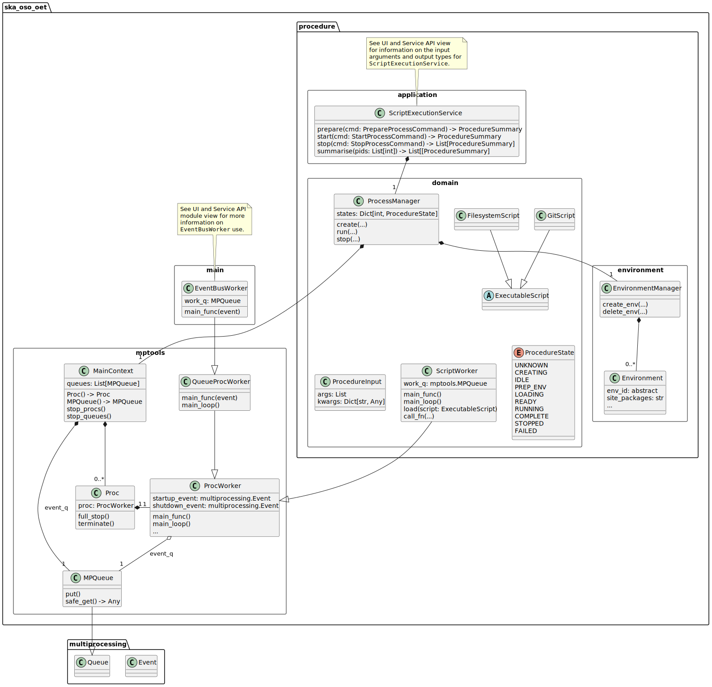
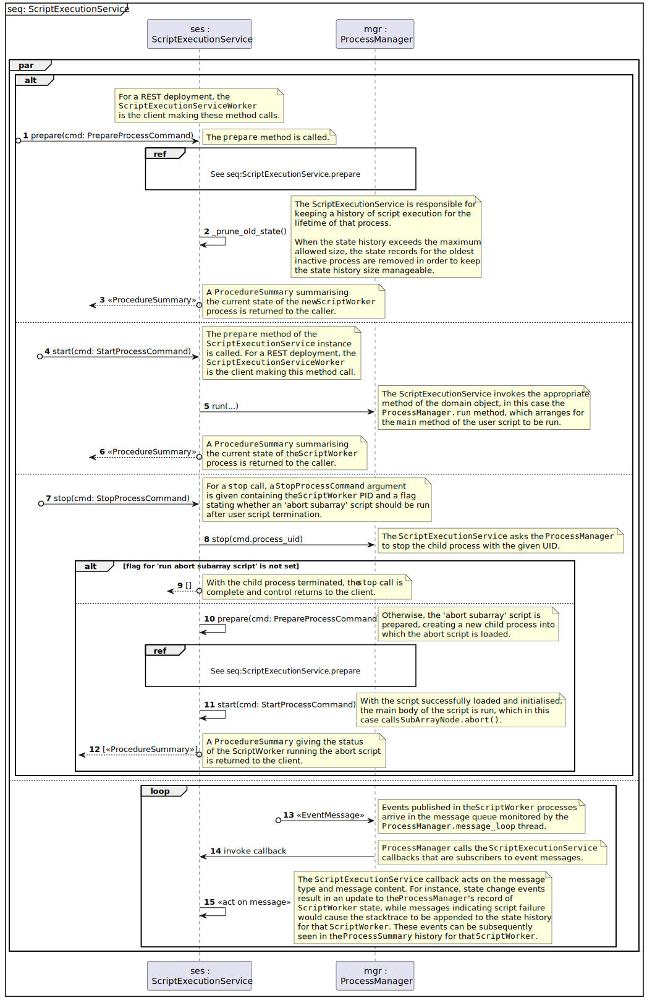
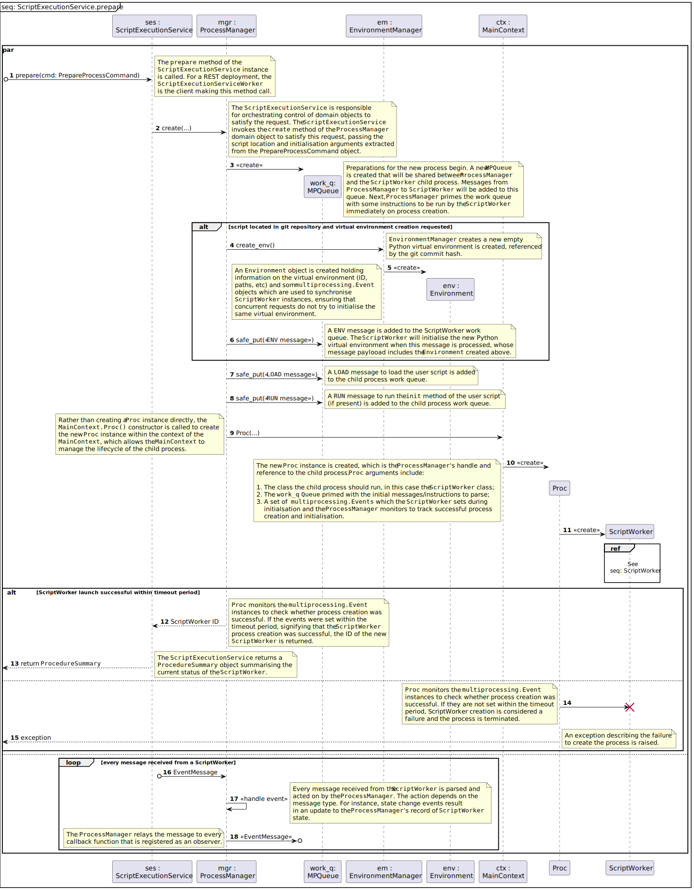
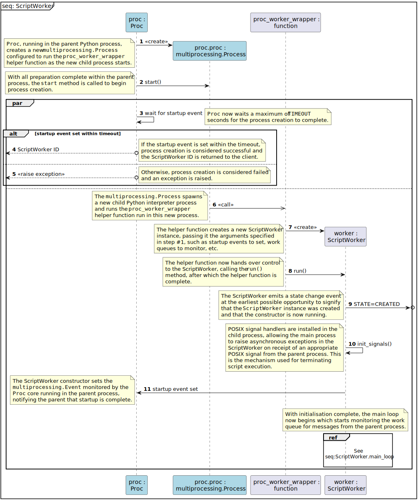
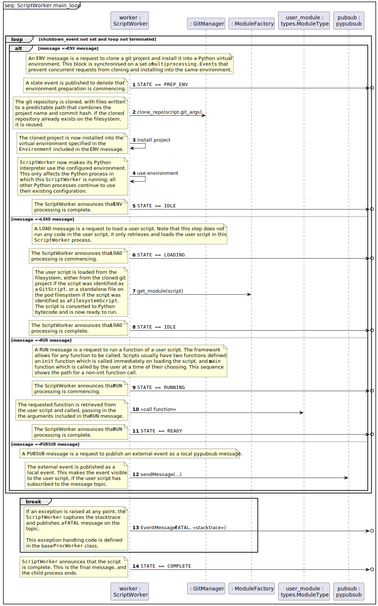
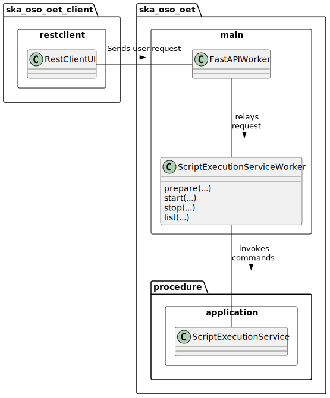

.. _architecture_backend_module_execution:

*****************************
Module view: Script Execution
*****************************

.. note::
    Diagrams are embedded as SVG images. If the text is too small, please use your web browser to zoom in to the images,
    which should be magnified without losing detail.

This view is a module view depicting the key components involved in script execution; that is, creating new
Python processes that load a user script and run functions in that user script when requested.

Primary Presentation
====================

   Major classes responsible for the execution and management of user scripts.

Element Catalogue
=================

Elements and their properties
-----------------------------

.. list-table::
   :widths: 15 85
   :header-rows: 1

   * - Component
     - Description
   * - EmbeddedStringScript
     - *NOT IMPLEMENTED YET*
       |br|
       |br|
       EmbeddedStringScript holds a complete Python script as a string. This class has been identified as possibly being
       useful as it allows a SchedulingBlock to directly specify and inject the code to be run, but has not been
       implemented.
   * - :class:`~ska_oso_oet.procedure.environment.Environment`
     - Environment is a dataclass that holds the information required to identify a Python virtual environment and its
       location on disk. In addition, it holds synchronisation primitives to avoid race conditions between multiple
       requests to create the same environment, as would be the case for multiple requests to create virtual
       environments for the same git project and git commit hash.
   * - :class:`~ska_oso_oet.procedure.environment.EnvironmentManager`
     - EnvironmentManager is responsible for creating and managing Environments, the custom Python virtual environments
       in which a user script that requiring a non-default environment runs. Typically, this is the case for a request
       to run a script located in a git repository, where the request requires a more recent version of the
       ska-oso-scripting library or control scripts than was packaged with the OET.
       |br|
       |br|
       Environment creation can be expensive, typically taking 20-30 seconds to ready a new ska-oso-scripting
       environment and with all-new dependencies. For this reason, EnvironmentManager is designed to allow virtual
       environments to be shared for script execution requests that target the same git repository and commit, as
       uniquely identified by the git commit hash. EnvironmentManager currently has no policy for deleting virtual
       environments, and the number of virtual environments could in principle increase unbounded manner. A policy of
       maintaining all active environments and maintaining a maximum of *n* inactive environments is expected to be
       implemented.
   * - Event
     - The Event class manages a flag that can be set and/or inspected by multi Python processes. Events are commonly
       used to signify to observers of the Event that a condition has occurred. Event is part of the standard Python
       library.
   * - :class:`~ska_oso_oet.procedure.application.main.EventBusWorker`
     - EventBusWorker is a QueueProcWorker that relays pubsub events seen in one EventBusWorker process to other
       EventBusWorker processes. See :doc:`architecture_backend_module_ui` for more information.
   * - :class:`~ska_oso_oet.procedure.domain.ExecutableScript`
     - ExecutableScript is an abstract class for any class that defines a Python script to be executed.
   * - :class:`~ska_oso_oet.procedure.domain.FilesystemScript`
     - FilesystemScript captures the information required to run a Python script located within the filesystem of a
       deployed OET backend. As an example, in a Kubernetes context this could point to a script contained in the
       default preinstalled scripting environment, or a script made available in a persistent volume mounted by the
       OET pod.
   * - :class:`~ska_oso_oet.procedure.domain.GitScript`
     - GitScript captures the information required to run a Python script that is located in a git repository. It
       collects a set of identifying information that together can conclusively identify the specific script to be run,
       such as git repository, branch, tag, and commit hash.
   * - :class:`~ska_oso_oet.mptools.MainContext`
     - MainContext is the parent context for a set of worker processes that communicate via message queues. It defines
       a consistent architecture for event-based communication between Python processes and consistent behaviour for
       POSIX signal handling and process management.
       |br|
       |br|
       MainContext is responsible for routing messages between the ProcWorkers created within the scope of a
       MainContext. MainContext is also responsible for managing the termination of the child processes, first
       requesting that the child process co-operate and stop execution cleanly, before escalating and using increasingly
       forceful means to terminate unresponsive processes (e.g., SIGINT, then SIGHUP). Lastly, MainContext is responsible
       for the correct management of the Python multiprocessing primitives created within the scope of the MainContext
       that are used for inter-process communication and synchronisation.
   * - :class:`~ska_oso_oet.mptools.MPQueue`
     - MPQueue is an extension of the standard library multiprocessing.Queue that adds get/set methods that return
       booleans when the operation fails rather than raising exceptions, which makes the class easier to use in some
       contexts.
   * - :class:`~ska_oso_oet.mptools.Proc`
     - Proc represents a child Python process of a MainContext.
       |br|
       |br|
       Proc instances exist in the scope of a MainContext instance and in the same OS process as the parent MainContext.
       Procs are the MainContext's link to the ProcWorkers running in an independent operating system process with an
       independent Python interpreter. Every ProcWorker running in a child process is associated with one Proc.
       |br|
       |br|
       Each Proc is responsible for bootstrapping its ProcWorker and managing its lifecycle. Proc arranges for an
       instance of its referenced ProcWorker class to be initialised and run in a new child Python interpreter. Proc
       monitors the status of the creation process. If ProcWorker startup does not complete successfully, Proc will
       forcibly terminate the child process and report the error.
       |br|
       |br|
       Proc is able to terminate its associated ProcWorker, first by giving the ProcWorker chance to co-operatively
       exit by setting a shutdown event monitored by the ProcWorker. If the ProcWorker exit within a defined grace
       period set, Proc will forcibly terminate the ProcWorker's process.
       |br|
       |br|
       Proc does not contain any business logic or application-specific code, which should be contained in the
       ProcWorker - or more likely, a subclass of ProcWorker.
   * - :class:`~ska_oso_oet.procedure.domain.ProcedureInput`
     - ProcedureInput captures the anonymous positional arguments and named keyword arguments for a Python function
       call. ProcedureInput is used in the presentation model to help describe historic function calls as well as
       in the PrepareProcessCommand and StartProcessCommand to define the arguments for an upcoming call.
   * - :class:`~ska_oso_oet.procedure.domain.ProcedureState`
     - ProcedureState is an enumeration defining the states that a Procedure (a child ScriptWorker process running a
       Python script) can be in. The states are:

        * ``CREATING``: child process is being created but is not yet initialised or ready to process other actions.
        * ``IDLE``: child process has been successfully created and is ready to process the next instruction.
        * ``PREP_ENV``: virtual environment for the user script is being prepared and its dependencies installed.
        * ``LOADING``: user script is being retrieved and loaded.
        * ``READY``: user script is fully initialised and ready to run.
        * ``RUNNING``: a function of the user script is being run.
        * ``COMPLETE``: the user script has completed successfully and the child process exited cleanly.
        * ``STOPPED``: the user script was forcibly terminated
        * ``FAILED``: the script process terminated due to an exception.
        * ``UNKNOWN``: script termination failed, leaving the script in an unknown state and effectively unmanaged
   * - :class:`~ska_oso_oet.procedure.domain.ProcessManager`
     - ProcessManager is the parent for all script execution processes. Specifically, it is the parent of all the
       ScriptWorker instances that run user code in a child Python process. ProcessManager is responsible for launching
       ScriptWorker processes and communicating relaying requests such as 'load user script *X* from git repository
       *Y*' 'run main() function' or 'stop execution' to the running scripts.
       |br|
       |br|
       As the parent of the script execution processes, ProcessManager has the power to forcibly terminate a
       ScriptWorker if it fails to respond to a shutdown request. This power is used when 'abort execution' is called
       to ensure that the script does not continue to send telescope control commands. Currently, a 'hard abort' is
       implemented that in effect does a 'kill -9' on the script. Introduction of a less abrupt 'soft abort' request
       that asks the script to co-operate in terminating execution is planned but not yet implemented.
       |br|
       |br|
       ProcessManager currently maintains its own event bus - that is, it's own MainContext - and is responsible for
       relaying script events issued by the ScriptWorker or user script through to the MainContext monitored by the
       rest of the system. This responsibility is likely to be removed in a future refactoring as the OET consolidates
       on a single event bus.
       |br|
       |br|
       ProcessManager is aware of the current state of ScriptWorkers it owns but does not maintain a state history,
       which as a property spanning multiple transactions is the responsibility of the ScriptExecutionService.
   * - :class:`~ska_oso_oet.mptools.ProcWorker`
     - ProcWorker is a template class for code that should execute in a child Python interpreter process.
       |br|
       |br|
       ProcWorker contains the boilerplate code required to set up a well-behaved child process. It handles starting
       the process, connecting signal handlers, signalling the parent that startup completed, and monitoring whether
       shutdown has been requested. ProcWorker does not contain any business logic, implementing a simple loop that
       repeatedly runs the abstract `main_func()` function for as long as the shutdown event is not set.
   * - Queue
     - Queue is a class that implements a multi-consumer, multi-producer FIFO queue that can be shared between Python
       processes. Queue is part of the standard Python library.
   * - :class:`~ska_oso_oet.mptools.QueueProcWorker`
     - QueueProcWorker is a ProcWorker that loops over items received on a message queue, calling the abstract
       `main_func()` function for every item received. Together with the ProcWorker base class functionality,
       QueueProcWorker will call `main_func()` for every event received for as long as the shutdown event is not set.
   * - :class:`~ska_oso_oet.procedure.application.application.ScriptExecutionService`
     - ScriptExecutionService provides the high-level API for the script execution domain, presenting methods that
       'start script _Y_' or 'run method _Y_ of user script _Z_'. The ScriptExecutionService orchestrates control of the
       ProcessManager and associated domain objects in order to satisfy an API request.
       |br|
       |br|
       In addition to its primary responsibility of triggering actions in response to API calls, ScriptExecutionService
       is also responsible for recording script execution history and providing a summary of process state.
       See :doc:`architecture_backend_module_ui` for more information.
   * - :class:`~ska_oso_oet.procedure.domain.ScriptWorker`
     - ScriptWorker is a class that can loads a user script in a child process, running functions of that user script on
       request.
       |br|
       |br|
       ScriptWorker is a ProcWorker that loops over messages received on a message queue, taking an appropriate action
       for every item received on that queue. It responds to four types of messages:

        #. clone a git project, installing that project into a Python virtual environment if required
        #. load a user script in this process
        #. run a named function of the user script in this process
        #. publish a message emitted by another OET component within this process

Element Interfaces
------------------

The major public interface in these interactions is the ScriptExecutionService API. For more information on this
interface, please see the API documentation for
:py:class:`~ska_oso_oet.procedure.application.application.ScriptExecutionService`.

Element Behaviour
-----------------

ScriptExecutionService
~~~~~~~~~~~~~~~~~~~~~~

The sequence diagram below gives a high-level overview of how the
:class:`~ska_oso_oet.procedure.application.application.ScriptExecutionService` controls objects in the domain module to
meet requests to prepare, start, and stop user script execution.

|br|

ScriptExecutionService.prepare
~~~~~~~~~~~~~~~~~~~~~~~~~~~~~~

The diagram below gives more detail on how the domain layer handles a request to prepare a script for execution.

|br|

ScriptWorker
~~~~~~~~~~~~

The diagram below illustrates how a :class:`~ska_oso_oet.procedure.domain.ScriptWorker` is created and how it
communicates startup success with the parent process.

|br|

ScriptWorker.main_loop
~~~~~~~~~~~~~~~~~~~~~~

The diagram below depicts the main :class:`~ska_oso_oet.procedure.domain.ScriptWorker` message loop, illustrating how
the various messages from the parent :class:`~ska_oso_oet.procedure.domain.ProcessManager` are handled by child
:class:`~ska_oso_oet.procedure.domain.ScriptWorker`.

|br|

Context Diagram
===============

|br|

Variability Guide
=================

N/A

Rationale
=========

N/A

.. |br| raw:: html

       
