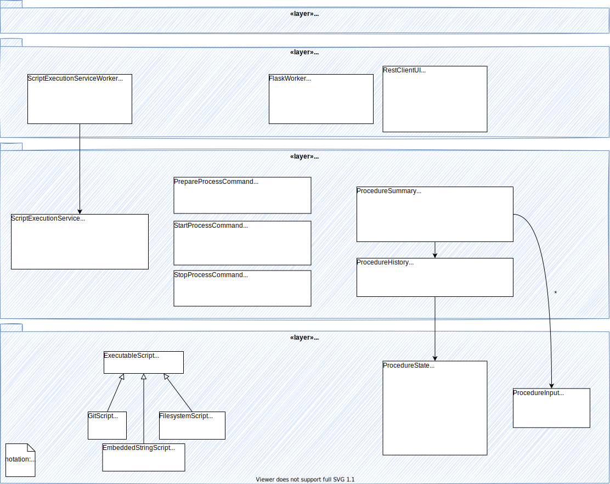

.. _architecture_backend_module_ui:

*******************************************************
OET backend module view: User Interface and service API
*******************************************************

Primary Presentation
====================

   Major classes involved in the user interface and the interface to the script execution domain.

Elements and their properties
=============================

Components
----------

.. list-table::
   :widths: 15 85
   :header-rows: 1

   * - Component
     - Description
   * - EmbeddedStringScript
     - EmbeddedStringScript holds a complete Python script as a string. This class has been identified as possibly being
       useful as it allows a SchedulingBlock to directly specify and inject the code to be run, but has not been
       implemented.
   * - ExecutableScript
     - ExecutableScript is an abstract class for any class that defines a Python script to be executed.
   * - FilesystemScript
     - FilesystemScript captures the information required to run a Python script located within the filesystem of a
       deployed OET backend. As an example, in a Kubernetes context this could point to a script contained in the
       default preinstalled scripting environment, or a script made available in a persistent volume mounted by the
       OET pod.
   * - FlaskWorker
     - FlaskWorker presents the ScriptExecutionService API as a REST service. The API of the REST service can be seen
       in :doc:`architecture_module_rest_api`. REST resources are accessed and modified to control script execution. As
       REST resources are accessed, FlaskWorker publishes an equivalent request event to the OET event bus, triggering
       the system to take the appropriate action to satisfy that request, and converts the response event back into an
       HTML response.
       |br|
       |br|
       The FlaskWorker component also present a Server-Sent Events (SSE) stream of all events sent over the
       OET event bus. This provides the mechanism for external visibility of OET actions, significant milestones, and
       user events emitted by the script such as 'subarray resources allocated', 'scan started', 'scan stopped', etc.
   * - GitScript
     - GitScript captures the information required to run a Python script located in a git repository. It collects
       a set of identifying information that together can conclusively identify the specific script to be run, such
       as git repository, branch, tag, and commit hash.
   * - PrepareProcessCommand
     - PrepareProcessCommand encapsulates all the information required to prepare a script for execution. It references
       both the script location and arguments that should be passed to the script initialisation function, if such a
       function is present.
   * - ProcedureHistory
     - ProcedureHistory represents the state history of a script execution process, holding a timeline of state
       transitions and any stacktrace resulting from script execution failure.
   * - ProcedureInput
     - ProcedureInput captures the anonymous positional arguments and named keyword arguments for a Python function
       call. ProcedureInput is used in the presentation model to help describe historic function calls as well as
       in the PrepareProcessCommand and StartProcessCommand to define the arguments for an upcoming call.
   * - ProcedureState
     - ProcedureState is an enumeration defining the states that a Procedure (a child ScriptWorker process running a
       Python script) can be in. The states are:

        * ``CREATING``: child process is being created but is not yet initialised or ready to process other actions.
        * ``IDLE``: child process has been successfully created and is ready to process the next instruction.
        * ``PREP_ENV``: virtual environment for the user script is being prepared and its dependencies installed.
        * ``LOADING``: user script is being retrieved and loaded.
        * ``READY``: user script is fully initialised and ready to run.
        * ``RUNNING``: a function of the user script is being run.
        * ``COMPLETE``: the user script has completed successfully and the child process exited cleanly.
        * ``STOPPED``: the user script was forcibly terminated
        * ``FAILED``: the script process terminated due to an exception.
        * ``UNKNOWN``: script termination failed, leaving the script in an unknown state and effectively unmanaged

   * - ProcedureSummary
     - ProcedureSummary is a presentation model capturing information on a script and its execution history. Through
       the ProcedureSummary, information identifying the script, the process running it, the current and historic
       process state, plus a timeline of all function called on the script and any resulting stacktrace can be resolved.
   * - RestClientUI
     - RestClientUI is a command line utility that accesses the OET REST API over the network. The RestClientUI provides
       commands for creating new script execution processes, invoking methods on user scripts, terminating scrip
       execution, listing user processes on the remote machine, and inspecting the state of a particular user script
       process.
   * - ScriptExecutionService
     - ScriptExecutionService provides the high-level API for the script execution domain, presenting methods that
       'start script _Y_' or 'run method _Y_ of user script _Z_'. The ScriptExecutionService orchestrates control of the
       ProcessManager and associated domain objects in order to satisfy an API request.
       |br|
       |br|
       In addition to its primary responsibility of triggering actions in response to API calls, ScriptExecutionService
       is also responsible for recording script execution history, which it achieves by monitoring for and recording script
       lifecycle change events. ScriptExecutionService manages the history state so that the number of records does not
       increase in an unbounded manner (currently, history is maintained for all active scripts and a maximum of 10
       inactive scripts (=any script that is complete).
       ScriptExecutionService provides a presentation model of a script and its
       execution history, which can be formatted for presentation via the REST service and CLI. This presentation model
       is called a ProcedureSummary.
   * - StartProcessCommand
     - StartProcessCommand encapsulates all the information required to call a method of a user script running on the
       OET backend. It captures information on the script process to target, the script function to call, and any
       arguments to be passed to the function.
   * - StopProcessCommand
     - StopProcesCommand encapsulates the information required to terminate a process. It holds information on which
       script process should be terminated and whether the 'abort subarray activity' follow-on script should be run.

Context
=======

.. figure:: diagrams/export/backend_candc_context.svg
   :align: center

Variability Guide
=================

N/A

Rationale
=========

.. |br| raw:: html

       
