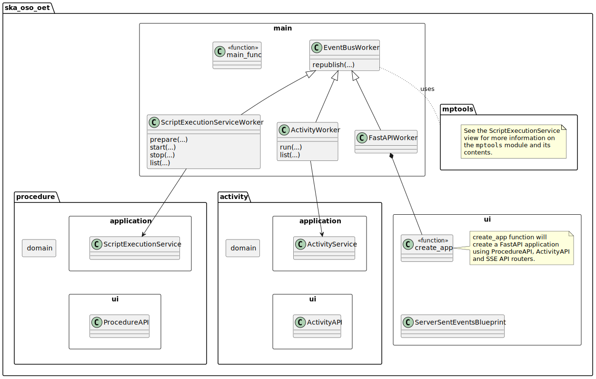
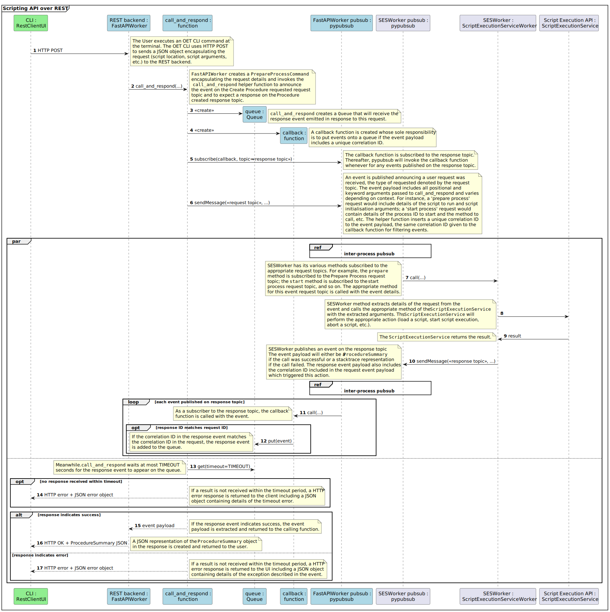

.. _architecture_backend_module_ui:

*******************************
Module view: UI and Service API
*******************************

.. note::
    Diagrams are embedded as SVG images. If the text is too small, please use your web browser to zoom in to the images,
    which should be magnified without losing detail.

This view is a module view showing the key components responsible for the OET interface, how they relay requests from
remote OET clients to the internal OET components responsible for meeting that request, and how the response makes
its way back to the client.

Primary Presentation
====================

   Major classes involved in the user interface and remote control of the script execution API.

Element Catalogue
=================

Elements and Their Properties
-----------------------------

.. list-table::
   :widths: 15 85
   :header-rows: 1

   * - Component
     - Description
   * - app
     - app is the Flask web application that makes the OET available over HTTP. The web application has the API
       blueprint and ServerSentEventsBlueprint registered, which makes the OET REST API and the OET event stream
       available when the web app is run.
   * - API
     - API is a Flask blueprint containing the Python functions that implement the OET REST API. HTTP resources in
       this blueprint are accessed and modified to control script execution. As the resources are accessed, the API
       implementation publishes an equivalent request event, which triggers the ScriptExecutionServiceWorker to take the
       appropriate action to satisfy that request. API also converts the response back to a suitable HTML response.
       |br|
       |br|
       The REST API is documented separately in :doc:`architecture_module_rest_api`.
   * - Blueprint
     - A Flask Blueprint collects a set of HTTP operations that can be registered on a Flask web application.
       Registering a Blueprint to a Flask application makes the HTTP operations in that blueprint available when
       the web application is deployed.
   * - EventBusWorker
     - EventBusWorker is a base class that bridges the independent pypubsub publish-subscribe networks so that a
       pypubsub message seen in one EventBusWorker process is also seen by other EventBusWorker processes.
       EventBusWorker is intended to be inherited by classes that register their methods as subscribers to pypubsub
       topics, so that the subclass method is called whenever an event on that topic is received.
   * - Flask
     - Flask (https://flask.palletsprojects.com) is a third-party Python framework for developing web applications. It
       provides an easy way to expose a Python function as a HTTP endpoint. Flask is used to present the functions in
       the restserver module as HTTP REST resources.
   * - FlaskWorker
     - FlaskWorker runs the 'app' Flask application. As a subclass of EventBusWorker, FlaskWorker also relays pypubsub
       messages to and from other Python processes.
   * - mptools
     - mptools is a Python framework for creating robust Python applications that run code concurrently in independent
       Python processes. See :doc:`architecture_backend_module_execution` for details.
   * - PrepareProcessCommand
     - PrepareProcessCommand encapsulates all the information required to prepare a script for execution. It references
       both the script location and arguments that should be passed to the script initialisation function, if such a
       function is present.
   * - ProcedureHistory
     - ProcedureHistory represents the state history of a script execution process, holding a timeline of state
       transitions and any stacktrace resulting from script execution failure.
   * - ProcedureSummary
     - ProcedureSummary is a presentation model capturing information on a script and its execution history. Through
       the ProcedureSummary, information identifying the script, the process running it, the current and historic
       process state, plus a timeline of all function called on the script and any resulting stacktrace can be resolved.
   * - pypubsub
     - pypubsub (https://pypubsub.readthedocs.io) is a third-party Python library that provides an implementation of the
       Observer pattern. It provides a publish-subscribe API for that clients can use to subscribe to topics. pypubsub
       notifies each subscriber whenever a message is received on that topic, passing the message to the client.
       pypubsub offer in-process publish-subscribe; it has no means of communicating messages to other Python processes.
   * - RestClientUI
     - RestClientUI is a command line utility that accesses the OET REST API over the network. The RestClientUI provides
       commands for creating new script execution processes, invoking methods on user scripts, terminating scrip
       execution, listing user processes on the remote machine, and inspecting the state of a particular user script
       process.
   * - ScriptExecutionService
     - ScriptExecutionService provides the high-level API for the script execution domain, presenting methods that
       'start script X' or 'run method Y of user script Z'. See :doc:`architecture_backend_module_execution` for details on
       how this is achieved.
       |br|
       |br|
       In addition to its primary responsibility of triggering actions in response to API calls, ScriptExecutionService
       is also responsible for recording script execution history, which it achieves by monitoring for and recording script
       lifecycle change events. ScriptExecutionService manages the history state so that the number of records does not
       increase in an unbounded manner (currently, history is maintained for all active scripts and a maximum of 10
       inactive scripts (=any script that is complete).
       ScriptExecutionService provides a presentation model of a script and its
       execution history, which can be formatted for presentation via the REST service and CLI. This presentation model
       is called a ProcedureSummary.
   * - ServerSentEventsBlueprint
     - ServerSentEventsBlueprint is a Flask Blueprint contains the functions required to expose the OET event bus
       as a server-sent events stream (https://en.wikipedia.org/wiki/Server-sent_events). This SSE stream republishes
       all events sent over the OET event bus as HTTP data. This provides the mechanism for external visibility of OET
       actions, significant milestones, and user events emitted by the script such as 'subarray resources allocated',
       'scan started', 'scan stopped', etc.
   * - StartProcessCommand
     - StartProcessCommand encapsulates all the information required to call a method of a user script running on the
       OET backend. It captures information on the script process to target, the script function to call, and any
       arguments to be passed to the function.
   * - StopProcessCommand
     - StopProcesCommand encapsulates the information required to terminate a process. It holds information on which
       script process should be terminated and whether the 'abort subarray activity' follow-on script should be run.

Element Interfaces
------------------

The major interface between the UI and OET backend is the REST API presented by the FlaskWorker, which is documented
separately in :doc:`architecture_module_rest_api`.

Element Behaviour
-----------------

API invocation via HTTP REST
~~~~~~~~~~~~~~~~~~~~~~~~~~~~

The sequence diagram below illustrates how the components above interact to invoke a call on an remote
ScriptExecutionService instance in response to a request from a client. This diagram shows how the user request is
received by the FlaskWorker REST backend, how that triggers actions on independent ScriptExecutionServiceWorker process
hosting the ScriptExecutionService instance, and how the response is returned to the user.

|br|

Inter-process publish-subscribe
~~~~~~~~~~~~~~~~~~~~~~~~~~~~~~~

The sequence diagram below illustrates how in-process pypubsub messages are communicated to other processes, which is
an essential part of the communication between FlaskWorker and ScriptExecutionServiceWorker and forms the basis for how
event messages emitted by scripts can be published to the outside world in an HTTP SSE stream.

|br|

Context Diagram
===============

.. figure:: diagrams/export/backend_candc_context.svg
   :align: center

Variability Guide
=================

N/A

Rationale
=========

N/A

.. |br| raw:: html

       
