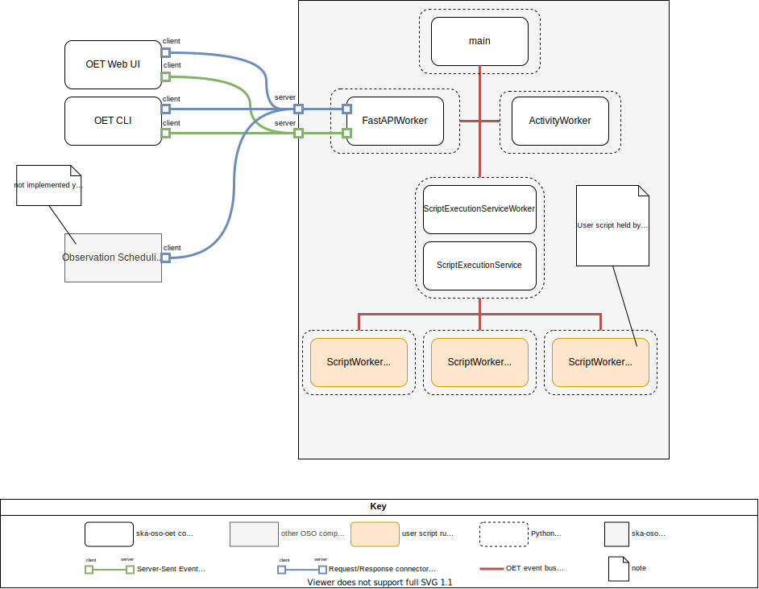

.. _architecture_backend_candc:

************************************
C&C view: OET client and OET backend
************************************

This view is a component and connector (C&C) view of the OET that depicts the primary OET clients and their connection
to the OET backend, and how the components of the backend are connected.

Primary Presentation
====================

Elements and their properties
=============================

Components
----------

.. list-table:: Key OET clients and core components of the OET backend
   :widths: 15 85
   :header-rows: 1

   * - Component
     - Description
   * - :class:`~ska_oso_oet.main.FlaskWorker`
     - FlaskWorker is a Flask application that presents a RESTful OET API, functioning as a REST adapter for the
       ScriptExecutionService. Scripts can be created, controlled, and terminated via the REST API. The FlaskWorker
       presents a REST resource for each script process created and managed by the ProcessManager.
       |br|
       |br|
       FlaskWorker also presents a Server-Sent Event (SSE) data stream, republishing each event seen on the OET event
       bus as an SSE event. This SSE stream gives remote clients visibility of actions taken by the OET backend and
       events announced by scripting libraries and user scripts.
   * - :func:`~ska_oso_oet.main.main`
     - The main component is the first component to be started when the OET backend is launched. It has two major
       responsibilities: first, it launches and thereafter manages the lifecycle of all components comprising the OET
       backend apart from the 'script process', whose lifecycle is managed separately by the script
       supervisor component. Second, it manages the OET event bus, routing OET events between backend components.
       |br|
       |br|
       The main component is responsible for establishing correct POSIX signal handling for the OET backend. For
       example, main instructs other OET backend components to terminate when a SIGHUP signal is received.
       |br|
       |br|
       The main component is the parent OS process of all other OET backend component processes.
   * - OET Web UI
     - **NOT IMPLEMENTED YET**
       |br|
       |br|
       The OET Web UI is a web interface for the OET that can be used to submit SBs for execution. This interface is
       intended to operate from the perspective of SB execution rather than generic script execution, thus providing a
       more user-friendly interface than the OET CLI that an operator or tester could use until the OST is available.
   * - OST
     - **NOT IMPLEMENTED YET**
       |br|
       |br|
       The SKA Online Scheduling Tool (OST) instructs the OET which SB should be executed next, taking into account
       aspects such as telescope resource availability, observing conditions, source visibility, science priority, etc.
   * - :class:`~ska_oso_oet.procedure.application.restclient.RestClientUI`
     - RestClientUI provides a command-line interface for invoke actions on the OET backend. The CLI is a general interface
       whose operations (currently) focus on the script execution perspective (load script, abort script, etc.) rather
       than the telescope-domain use cases (assign resources to subarray, execute SB, etc.).
       |br|
       |br|
       In addition to controlling script execution, the CLI can be used to inspect the status of scripts that have run
       or are running.
   * - :class:`~ska_oso_oet.main.ScriptExecutionServiceWorker`
     - ScriptExecutionServiceWorker responds to requests received by the FlaskWorker, relaying the request to the
       ScriptExecutionService and publishing the response as an event that can be received by the FlaskWorker and
       returned to the user in the appropriate format.
   * - :class:`~ska_oso_oet.procedure.application.ScriptExecutionService`
     - ScriptExecutionService present the high-level API for script execution. The ScriptExecutionService orchestrates
       control of internal OET objects to satisfy an API request. ScriptExecutionService is also responsible for
       recording script execution history. ScriptExecutionService can return a presentation model of a script, its
       current state, and its execution history. See ProcedureSummary in the backend module view.
   * - :class:`~ska_oso_oet.procedure.domain.ScriptWorker`
     - ScriptWorker represents the child Python process running the requested user script. For SKA operations, most
       scripts executed by the OET, and hence scripts that will run in a Script Process, will be 'observing scripts'
       that control an SKA subarray. The content and purpose of these 'observing scripts' is contained and defined in
       the ska-oso-scripting project.
       |br|
       |br|
       Note that the OET backend is independent of the content and function of the script, which could serve any purpose
       and is not limited to Tango-based telescope control.

Connectors
----------

.. list-table:: Connectors between OET clients and the OET backend
   :widths: 15 85
   :header-rows: 1

   * - Connectors
     - Description
   * - REST over HTTP
     - REST over HTTP defines a request/response connector that is used by a client to invoke services on a server using
       REST over HTTP. Script processes are presented as REST resources by the OET backend. Using the REST over HTTP
       connector, clients can control the lifecycle and/or inspect the status of scripts running in the OET backend.
   * - OET event bus
     - OET event bus connector defines an internal pub/sub connector used by an OET component to publish and subscribe
       to OET events (messages) sent on a topic.
   * - Server-Sent Event
     - SSE connector defines a connector that is used by a client to listen to a continuous data stream of SSE events
       sent over a HTTP connection from an SSE server. SSE connectors have a client role and a server role. The SSE
       connector is used to give clients visibility of OET events published on the OET event bus.

Context
=======

.. figure:: ../../diagrams/export/backend_candc_context.svg
   :align: center

Variability Guide
=================

The OET CLI reads the ``OET_URL`` environment variable to find the URL of the OET REST server.

Rationale
=========

REST over HTTP
--------------
REST over HTTP was selected as the protocol for remote control of the backend control for two reasons. First, we needed
a protocol that was supported by multiple languages, anticipating that the OET web UI might not be Python based. Second,
we preferred a stable and mature protocol with good library support. REST satisfies all these requirements, with good
Python library support for both REST clients and REST servers.

Server-Sent Events
------------------
Insights into remote OET activities and script execution are obtained by monitoring events sent on the OET event bus.
OET components, scripting libraries, and user scripts can all announce events of interest by publishing an event on the
OET event bus. Events are published on various topics, from the script lifecycle (script loaded, script running, script
aborting, script aborted, etc.), through to the SB lifecycle (SB resources allocated, observation started, observation
complete, etc.) and subarray lifecycle (resources allocated, resources configured, scan started, etc.).

We needed a mechanism that would give the OET CLI, and possible the OET web UI at some future date, a tap into these
events broadcast inside a remote OET backend. This use case requires the server to push events as they happen and have
the client process/display them as they are received. Standard synchronous HTTP request/response does not map easily
onto this use case and so we searched for a standard that would allow server-pushed messages. Any mechanism would also
need to be language independent, mature, easily implemented and easily deployable in a Kubernetes setting, just as for
REST over HTTP.

Server-Sent Events (SSE) was selected as it satisfies all of these criteria. SSE operates over HTTP, and the SSE API is
standardised as part of HTML5. SSE has growing language support, including Python server and client library support,
which helps keep the OET implementation simple. As it operates over HTTP, it can be delivered via the same Kubernetes
ingress as the OET REST API.

No dedicated message broker
---------------------------
Systems that use a message-oriented architecture often use an dedicated message broker component such as RabbitMQ or
Kafka whose sole responsibility is the delivery of messages to subscribers. Using a dedicated message broker can
increase scalability by allowing multiple distributed brokers, increase reliability by allowing guaranteed message
delivery, and promote system modifiability and composability by allowing routing of messages to inhomogeneous, loosely
coupled, and potentially distributed subscribers via the network.

The OET does not currently use an external message broker as simplicity of deployment and reduced system complexity are
currently prioritised over the advantages that an external message broker brings. Routing messages via a network broker
would introduce complexity, overhead, and failure modes that are unnecessary in a homogeneous system with message
publishers and message subscribers running in the same process space on the same host. We assume that message
delivery through Python multiprocessing queues - essentially, communication via UNIX pipes - is robust
and does not require message delivery guarantees. Additionally, telescope control scripts are not designed to be
resumed in the event of failure, hence there is no value in resending any message lost to a failed ScriptWorker to a new
replacement ScriptWorker. There is also a desire to keep the OET deployment footprint small and with minimal
dependencies so that the OET can be easily incorporated and/or deployed in a simulator context for other OSO use.

That said, the OET architecture does allow the introduction of a dedicated message broker if the OET requirements
change.

.. |br| raw:: html

       
