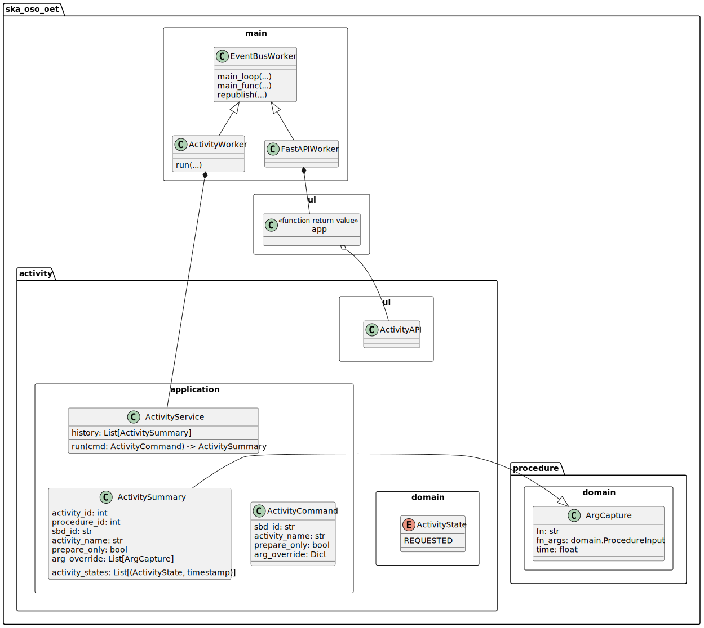

.. _architecture_backend_module_activity_ui:

****************************************
Module view: Activity UI and Service API
****************************************

.. note::
    Diagrams are embedded as SVG images. If the text is too small, please use your web browser to zoom in to the images,
    which should be magnified without losing detail. Alternatively open image in a new tab with right click + Open in
    a new tab.

This view is a module view depicting the key components involved in SB activity execution; that is, requesting
an activity described by a Scheduling Block to be run.

Primary Presentation
====================

   Major classes responsible for the execution and management of activities.

Element Catalogue
=================

Elements and their properties
-----------------------------

.. list-table::
   :widths: 15 85
   :header-rows: 1

   * - Component
     - Description
   * - :class:`~ska_oso_oet.activity.ui`
     - Contains the Python functions that implement the Activity resources on the OET REST API. These HTTP resources
       are accessed and modified to control SBDefinition. As the resources are accessed, the API
       implementation publishes an equivalent request event, which triggers the ScriptExecutionServiceWorker to take the
       appropriate action to satisfy that request. API also converts the response back to a suitable HTML response.
       |br|
       |br|
       The REST API is documented separately in :doc:`architecture_module_rest_api`.
   * - :class:`~ska_oso_oet.activity.domain.ActivityState`
     - ActivityState is an enumeration defining the states that an Activity (a concept linking Scheduling Blocks
       to Procedures) can be in. State machine for activities has not yet been completely defined and currently
       Activity can only be in state ``TODO``.
   * - :class:`~ska_oso_oet.activity.application.ActivityService`
     - ActivityService provides the high-level API for the activity domain, presenting methods that
       'run a script referenced by activity *X* of scheduling block *Y*'. The ActivityService completes user requests
       by translating the activity requests into Procedure domain commands which then execute the scripts.
       |br|
       |br|
       The steps taken by the ActivityService to construct a PrepareProcedureCommand are:

        #. retrieve the Scheduling Block by ID from the ODA using the ODA client library
        #. write Scheduling Block to a JSON file as `/tmp/sbs/<sb_id>-<version>-<timestamp>.json`
        #. convert PDM FileSystemScript object referenced by the given SB and activity to OET FileSystemScript
        #. create a collection of init and run arguments by combining user-defined functions arguments with arguments listed in the SB
        #. add the path to previously written SB JSON file to the run function arguments under key `sb_json`
        #. create PrepareProcessCommand using the FileSystemScript object and arguments for `init` function from the collection of function arguments

       |br|
       After the prepare command has been sent, it will wait for a response to record the procedure ID of the
       script relating to the activity. If `prepare_only` argument is set to false, ActivityService will create
       a StartProcessCommand and send it to the ScriptExecutionServiceWorker. It will include the Procedure ID,
       and request that function named `run` will be executed with the corresponding arguments.
   * - :class:`~ska_oso_oet.main.ActivityServiceWorker`
     - For a the OET REST deployment, ActivityServiceWorker is the client sending requests to the ActivityService.
       |br|
       |br|
       ActivityWorker responds to requests received by the FastAPIWorker, relaying the request to the
       :class:`~ska_oso_oet.activity.application.ActivityService`
       and publishing the response as an event that can be received by the FastAPIWorker and returned to the user in the
       appropriate format.

Element Interfaces
------------------

The major public interface in these interactions is the ActivityService API. For more information on this
interface, please see the :doc:`architecture_module_rest_api`.

Element Behaviour
-----------------

Activity API invocation via HTTP REST
~~~~~~~~~~~~~~~~~~~~~~~~~~~~~~~~~~~~~

The sequence diagram below illustrates how the components above interact to invoke a call on an remote
ActivityService instance in response to a request from a client. This diagram shows how the user request
is received by the FastAPIWorker REST backend, how that triggers actions on independent ActivityWorker process
hosting the ActivityService instance, and how the response is returned to the user

|br|

Inter-process publish-subscribe
~~~~~~~~~~~~~~~~~~~~~~~~~~~~~~~

The Activity domain uses the same publish-subscribe system as Procedure domain for both communication between
FastAPIWorker and ActivityServiceWorker and for the ActivityService to communicate with the ScriptExecutionServiceWorker.
For a diagram illustrating the flow of in-process pypubsub messages, see the :ref:`Inter-process publish-subscribe section <architecture_backend_module_script_exec_ui_pubsub>`
in the script execution API documentation.

Variability Guide
=================

N/A

Rationale
=========

Storing Scheduling Block in the Filesystem
------------------------------------------
It is currently only possible to deploy the activity and procedure services as one service. This
means that the Scheduling Block can be written to file by the ActivityService and it will still
be available to the Procedure domain. In the future the Activity and Procedure related services
could be deployed in different locations so the current approach of saving SBs to a file should
be refactored so that the script running on a different server can also access the SB.

Scheduling Block URI
--------------------
Currently the Scheduling Block URI used in the OET system is a simple path string to a JSON file
referred to by a keyword argument `sb_json`. In the future this will be expanded into a proper URI
with several allowed prefixes such as `file://` for SB located in a file and `oda://` for SB that
should be retrieved from the ODA.

.. |br| raw:: html

       
