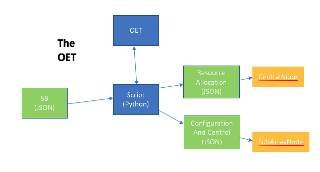

.. _observing-scripts:

*****************
Observing Scripts
*****************

-------
Context
-------

The `SKA Project Data Model (PDM) <https://developer.skatelescope.org/projects/ska-project-data-model-library/en/latest/?badge=latest>`_ 
describes the structure of a Scheduling 
Block (SB) as a high-level JSON [#f1]_ specification of an individual, 
self-contained observation on one of the SKA Telescopes. SBs are the 
atomic units of observation with the SKA. 

At any time the SKA observing system will have a pool of pending SBs
awaiting execution. As they are selected, SBs will be run by the
subject of this project the  
Observation Execution Tool (OET). The OET actually runs a Python *observing 
script* to do the work and it is the job of this script to 'connect’ the SB 
to the series of lower level commands and configurations that must be sent 
to the telescope for execution. 

*How is the script chosen? Will this be set 
by the observing mode or explicitly in the SB?*

The syntax of the commands and configurations required by the telescope 
are described in the 
`SKA Configuration Data Model (CDM) <https://developer.skatelescope.org/projects/cdm-shared-library/en/latest/index.html>`_ . 
The telescope appears to the high-level user as two software devices: the 
CentralNode is the target for commands to allocate resources to form a 
SubArrayNode, and release them again when the SubArrayNode is no longer
needed after the observation; the SubArrayNode is the target for commands 
to configure and scan to take data during the observation.

The layout of objects is illustrated in Fig.1.

Figure 1. The place of the observing script in relation to the SB, OET, and 
telescope software devices.

----------------------------
What is an Observing Script?
----------------------------
The observing script is some Python code whose purpose is to enact an SB. In 
practice, there may also be observing scripts that enact handy sections of 
an SB for development purposes, such as resource allocation, scans, 
resource deallocation, etc. 

To achieve its aims the script must send a series of commands in the correct 
order. For example, to enact a whole SB:

1. Command the CentralNode to allocate the required resources and instantiate 
   the SubArrayNode. This will require the extraction of the resources required
   from the SB JSON, and the constructing of the CDM JSON describing them.
2. Using the SubArrayNode, loop through the scans required by the SB:

   a. Command the SubArrayNode to configure for the scan. This will require
      that the pointing and receiver configurations be extracted from the
      SB, and the CDM description of these requirements be constructed.
   b. Command the SubArrayNode to scan (that is, take data).

3. Tell the SubArrayNode and CentralNode that the SB is complete.
4. Command the CentralNode to release the resources in the SubArrayNode.

--------------------------
Helper Classes and Methods
--------------------------
The OET, PDM and CDM projects have provided helper classes and functions
to hide from the high-level user some of the complexity of the SB and CDM 
JSON structures and the telescope devices.

OET helpers reside in two modules,
:ref:`oet.domain <domain-guide>` and 
:ref:`oet.observingtasks <observingtasks-guide>`. 

PDM helpers are documented in the
`PDM documentation <https://developer.skatelescope.org/projects/ska-project-data-model-library/en/latest/index.html>`_ .

CDM helpers are described in the 
`CDM documentation <https://developer.skatelescope.org/projects/cdm-shared-library/en/latest/?badge=latest>`_ .

.. rubric:: Footnotes

.. [#f1] JSON (JavaScript Object Model) is a structured
         human and machine readable script designed to communicate data objects.

