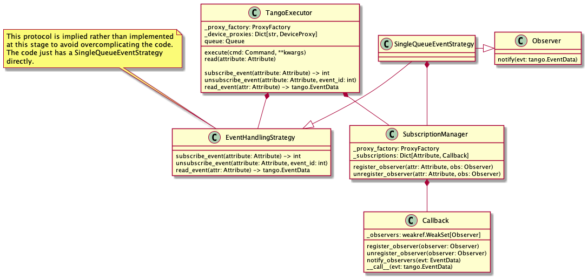
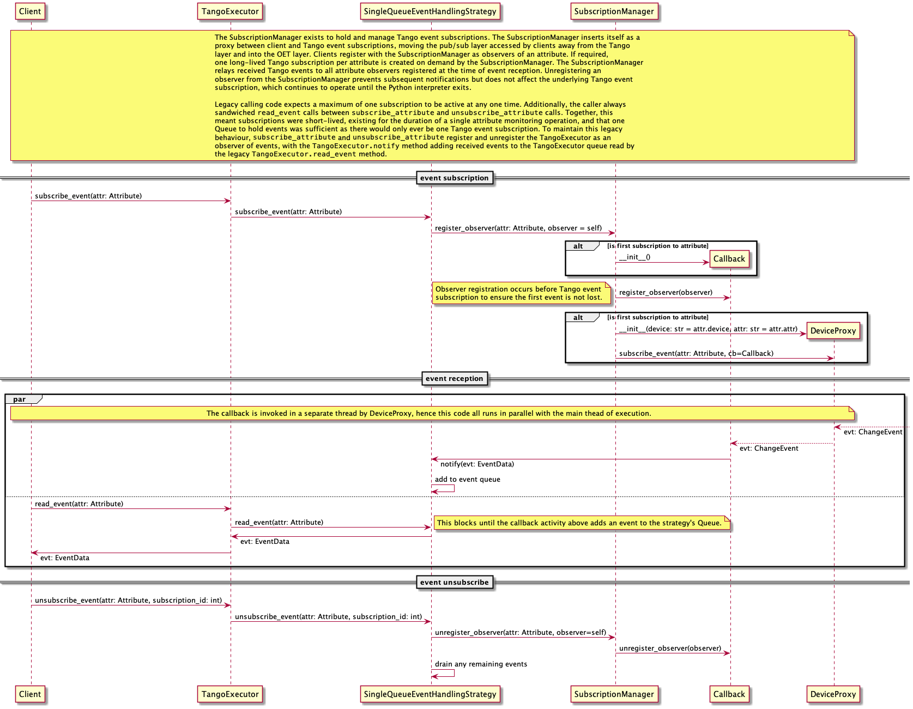

.. _command-guide:

***********
oet.command
***********

Event handling
**************
The SubscriptionManager component is responsible for managing events and event subscriptions in the OET. The
SubscriptionManager sits as a proxy between client and Tango event subscriptions, moving the pub/sub layer accessed by
clients away from the Tango layer and into the OET layer. Clients register with the SubscriptionManager as observers of
an attribute. If required, one long-lived Tango subscription per attribute is created on demand by the
SubscriptionManager. The SubscriptionManager relays received Tango events to all attribute observers registered at the
time of event reception. Unregistering an observer from the SubscriptionManager prevents subsequent notifications but
does not affect the underlying Tango event subscription, which continues to operate until the Python interpreter exits.

Legacy calling code expects a maximum of one subscription to be active at any one time. Additionally, the caller always
sandwiched ``read_event`` calls between ``subscribe_attribute`` and ``unsubscribe_attribute`` calls. Together, this
meant subscriptions were short-lived, existing for the duration of a single attribute monitoring operation, and that one
Queue to hold events was sufficient as there would only ever be one Tango event subscription. To maintain this legacy
behaviour, ``subscribe_attribute`` and ``unsubscribe_attribute`` register and unregister the TangoExecutor as an
observer of events, with the ``TangoExecutor.notify`` method adding received events to the TangoExecutor queue read by
the legacy ``TangoExecutor.read_event`` method.

   Class diagram for components involved in OET event handling

   Sequence diagram from OET event handling

API
***

.. automodule:: oet.command
    :members:
